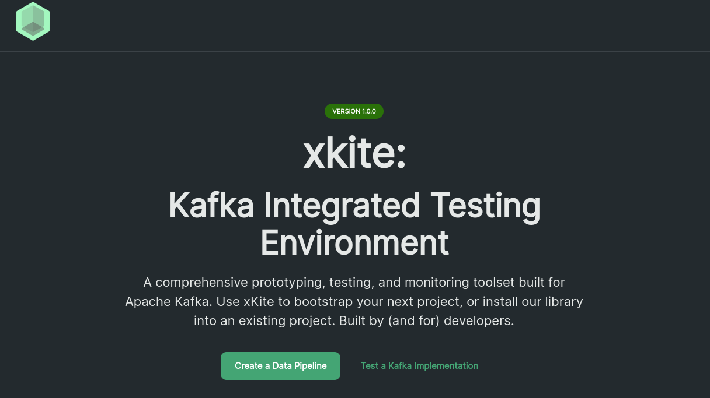
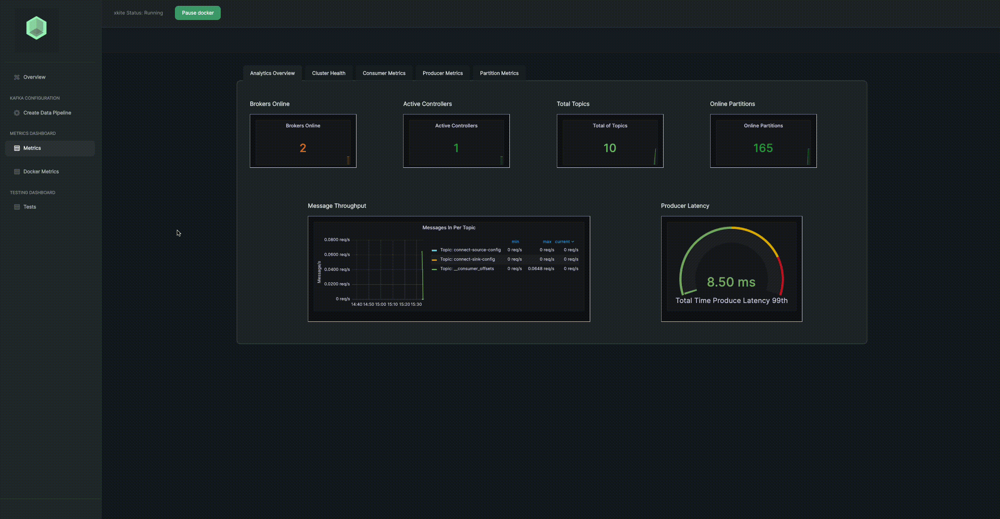
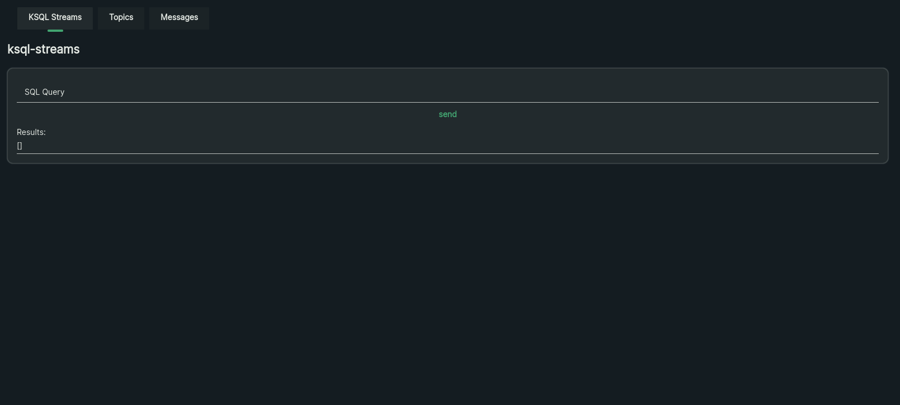

<div align='center'>
  
<a href='https://github.com/oslabs-beta/xkite/releases'>
  

  
</a>
  
<a href='https://github.com/oslabs-beta/xkite/blob/main/LICENSE'>
  

  
</a>
<a href="https://xkite.io/"></a>
</div>

<br />

A Graphical User Interface (GUI) for Kafka Integrated Testing Environment (<b>KITE</b>)

The xkite GUI supports comprehensive prototyping, testing, and monitoring toolset built for Apache Kafka.

Built upon <b><a href="https://github.com/oslabs-beta/xkite-core">xkite-core library</a></b>, xkite GUI provides functionality to configuring a YAML file, managing docker containers (configure, run, pause, and shutdown), interfacing with a remote xkite servers, and exporting their configuration to deploy their docker ecosystem to the cloud.

Use xkite to bootstrap your next project, or install our library into an existing project. Built by (and for) developers.

Note: xkite is also available without the full graphical user interface using our <b><a href="https://github.com/oslabs-beta/xkite-cli">xkite-cli</a></b>.

# Dependencies

- Latest stable versions of Node.js and NPM installed
- Latest stable version of <a href="https://docs.docker.com/compose/install/">docker-compose</a> installed.
- Docker daemon is running for reference: <a href="https://docs.docker.com/get-started/overview/">Docker Getting Started</a>
- Clone repository: <code>git clone https://github.com/oslabs-beta/xkite.git</code>
- Install dependencies: Run <code>npm install</code> inside the project folder

# Quick Start

To install/run the <code>xkite</code> GUI please use the following command:

```sh
  $ npx create-xkite <directory-name>
```

After the installation is complete, users can start the server by following the steps below:

1. ```sh
   $ cd <directory-name>
   ```
2. ```sh
   $ npm run dev
   ```

A browser window will open on http://localhost:3000 where users will see the live preview of the application.

Note: If the port 3000 is not available the server will start on the closest available port after 3000.

## Note

- Users must have Docker daemon active and running to initiate an xkite local deployment.

## Built With

<div align='center'>


</div>

# Overview

The overiew page is the main page when visiting the xkite GUI website. The user is presented with two options:

1. Create a data pipeline - allows the user to configure their own Kafka ecosystem for test.
2. Test an existing Kafka Implementation - allows the uset to test an existing running Kite Kafka ecosystem. [Tests](#tests)




# Configuration

<details><summary><b>Configuring A Cluster</b></summary>

When users first navigate to the Configuration Page, users will be presented with the options to:

1. Choose the number of Kafka Brokers
2. Choose the number of Replicas for Kafka Broker
3. Choose the number of Zookeepers
4. Choose a database of either KSQL or Postgresql as the Data Source.
   a. <b>Note</b>: Data Source integration other than KSQL is not yet supported.
5. Choose either Juypter Notebook or Spark as the Data Sink.
   a. <b>Note</b>: Data Sink integration is not yet supported.
6. See [Advanced Settings Menu](#advanced-settings-menu) for details on options.


## Advanced Settings Menu

The Advanced Settings Menu offers the user the ability to customize their port configuration. For each component in any xkite configuration, the user can customize ports for the following using the advanced settings menu:

1. JMX exporter images
2. Containerized Spring application
3. Brokers
4. Zookeeper 
5. Grafana
6. Prometheus

</details>

<details><summary><b>Deploying A Cluster</b></summary>

After users have made their desired settings using the steps above, they're ready to deploy a xkite configuration. Select the "Submit" button in bright green. This will engage the following processeses:

1. xkite communicates with a running Docker daemon on the user's machine to begin building the required containers
2. Docker will download the images required to run setup (this may take several minutes if it's a user's first time running xkite)
3. The xkite interface will wait until all of the containers in a configuration are ready such that each connecting data pipeline is active
4. The xkite interface will automatically navigate the user to the "Metrics" tab where they can begin viewing Kafka metrics relevant to their configuration

</details>


# Kafka Metrics

Once the appropriate Docker images in a configuration have been downloaded and built, xkite will automatically detect when the user's metrics are ready to begin monitoring. Upon detection, the user will be automatically be navigated to the Kafka metrics page.

Each tab within the Kafka metrics page is organized based on performance relevance. Here's a brief overview of each:

1. Overview: high-level performance summary, including metrics on total topics, number of online partitions, online brokers, active controllers, producer latency, and message throughput
2. Cluster Health: four graphs pertaining more specifically to health including failed produce/fetch requests per broker, and failed produce/fetch requests per topic
3. Consumer Metrics: relevant metrics specific to consumer performance including total fetch consumer latency, consumer fetch requests per broker, and total fetch requests per broker
4. Producer Metrics: performance metrics related to Kafka producers including total producer latency, producer latency per broker, total produce rate per topic, and produce requests per broker
5. Partition Metrics: important metrics on potentially under-replicated partitions, partition leader and replica per broker, and count of partitions per broker



# Docker Metrics

xkite integrates Docker health directly into the application interface, making it easy to view the activity status and port assignments of each Docker image in a configuration. To do so, users simply navigate to the `Docker Health` tab within the left-hand navigation bar. Users can also pause and restart Docker images directly from this page, or pause and restart all using the button in the top navigation.

The following is an overview of the features available on this page:

1. Container Information: a table containing rows that represent each container, including image name, time elapsed since it was created, status (up or paused), notice (green indicating running, yellow indicating transitioning, red indicating paused), action (explained below), and ports representing port assignment
2. Pause Restart Containers: users can pause or restart containers either individually within the container's respective row, or the entire xkite cluster using the "Pause Docker" button in the top navigation


# Tests

Users will find a `Tests` tab in their left-hand navigation. This feature allows users to test their deployment by creating new topics and sending test messages to those topics, as well as querying a KSQL instance directly from the xkite interface.

The following is an overview of the features available on this page:

1. KSQL Streams: test KSQL query streaming (explained separately below)
2. Topics: view existing topics, or create and add new clients to a configuration
3. Messages: send messages to existing topics and view messages in/second in real time

<details><summary><b>KSQL Streams</b></summary>

If a user has configured their xkite setup to include KSQL as their data source of choice, they will be presented with the option to create streams using the KSQL REST API on the `Tests` page. 

Here we'll highlight the exact steps users should follow to confirm and test their environment:

1. Open up Docker dashboard into the "Containers" tab, and navigate to the ksql_cli image
2. Open up the ksql_cli terminal, and enter the following to create the users table with some preconfigured entries:
```sh
$ ksql http://8088 <<EOF
> RUN SCRIPT /tmp/test.sql;
> exit
> EOF
```
3. Navigate back to the xkite test page within the "KSQL Streams" tab
4. Simply enter commands into the SQL Query field - here's are some example:
```sh
SELECT * FROM users EMIT CHANGES;
```
5. Below is an example of how this works:



</details>


# Exporting a Configuration & Disconnecting xkite

<details><summary><b>Exporting a Configuration</b></summary>

Once users have tested their xkite configuration and they're ready to port their settings over to another codebase or project, users can take the following steps to export a configuration:

1. Navigate back to the "Create Data Pipeline" tab
2. Click the "Export Config" button
3. Wait several moments while xkite packages the configuration into a zip file that will automatically be sent to the user's downloads folder

</details>

<details><summary><b>Disconnecting from xkite</b></summary>

Users can spin down their Docker containers once they're done monitoring and testing their configuration. Here are the following steps to do so:

1. Navigate back to the "Create Data Pipeline" tab
2. Click the "Disconnect" button
3. Standby while xkite communicates with Docker to remove both all containers and volumes relevant to that xkite session

</details>


# What Lies Ahead for xkite

Our team is excited about the massive potential at hand to extend xkite’s flexibility and developer experience even further in future iterations and feature releases, and you should be too! Some of these ideas include:

## A Re-build in Spring Boot

Our team considered the idea of building our application natively within the Spring Boot framework (our Spring app is already built this way). This would eliminate reliance on a Node.js client, and offer a more direct interface with producer/consumer functionality. This build could be ported to a WASM format that could be used in the KafkaConnector Class as a replacement to KafkaJS.

## Extend Spring App Flexibility

xkite's current Spring implementation has producer functionality but it has static topic message schemas. Future iterations could extend logic within the Spring app to provide an API to create and delete topics/schemas dynamically. 

## Connectivity for Cloud Deployments

While xkite is currently designed to facilitate local prototyping, testing, and monitoring, an ability to connect to production deployments would allow the application to extend through the production lifecycle as well.

## Additional Data Source + Sink Configurations

While xkite currently offers PostgreSQL and KSQL as data source options, and Jupyter Notebook and Apache Spark as sink options, additional flexibility around both the data source and sink could accommodate a larger array of potential use-cases and development teams.

## Add Configurable Broker Assignment Strategy for Spring

Spring and KafkaJS must be inline with each other. Right now they are set to a round-robin assignment strategy (which is a naive approach). Future iterations should optimize for customizable assignment strategies to allow for more user flexibility.

## Integrate NoSQL Support

xkite v1 accommodates two relational databases out of the box. Future iterations should accommodate a larger potential user base by extending support to integrate NoSQL databases.

## Allow Users to Configure SSL for Docker Images

Another future iteration should provide the option to secure login setup for docker instances.

## OAuth Sign-In Support

Future iterations might also include an OAuth sign-in option to xkite to save settings for relevant user sessions.

## Kubernetes Cluster Packaging

To support flexibility around larger xkite configurations, future versions might also include support for Kubernetes to package Docker containers.

## Finish Kafka-Connector Support

xkite currently includes the framework to make connections to/from the Kafka cluster using the kafka-connector-sink/src docker images. It would be a great value add to have these connectors configurable via user actions on front end automatically so they can connect their data source/sink directly to the Kafka cluster to facilitate message and topic creation and consumption.

# Want to Contribute?

Have an idea for how we can improve any of our Codebases or libraries? We would love your help! If you would like to contribute, please use the following format:

1. Fork the Github repository into your Github account
2. Clone your forked repository and create a new branch using your Github username as the name of your new branch
3. Commit the changes you'd like to contribute to your branch. Use a detailed description explaining what your code helps to optimize or fix
4. Create a pull request into the main branch of the xkite repository

# Want to Raise an Issue to Our Attention?

You can also raise an issue in Github if you'd like to bring one to our attention. We are genuinely grateful that you'd like to help make our developer tool better. If you'd like to raise an issue, we'd prefer that you use the following format:

1. What is the problem?
2. What did I expect to happen?
3. What have I tried?
4. (If applicable) Why I suspect it's not working