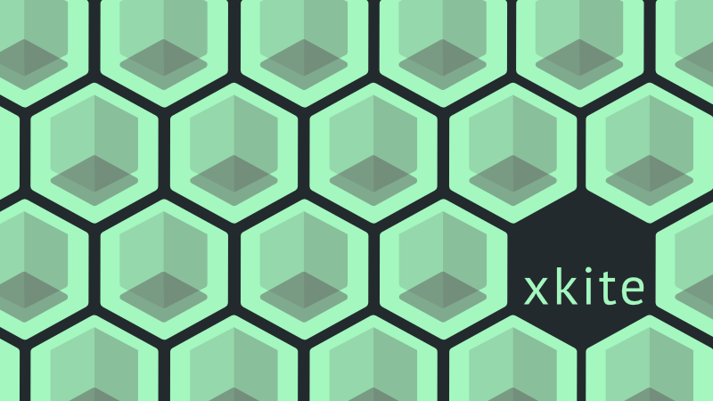
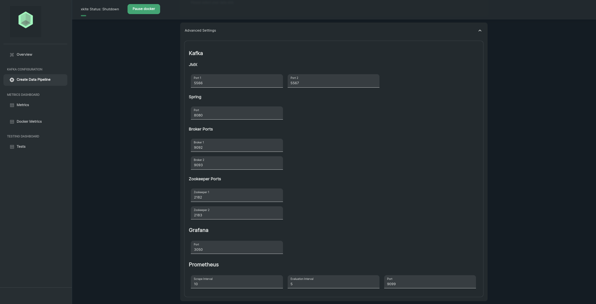

<div align='center'>
  
<a href='https://github.com/oslabs-beta/xkite/releases'>
  

  
</a>
  
<a href='https://github.com/oslabs-beta/xkite/blob/main/LICENSE'>
  

  
</a>
<a href="https://xkite.io/"></a>
</div>

<br />

A Graphical User Interface (GUI) for Kafka Integrated Testing Environment (<b>KITE</b>)

The xkite GUI supports comprehensive prototyping, testing, and monitoring toolset built for Apache Kafka.

Built upon <b><a href="https://github.com/oslabs-beta/xkite-core">xkite-core library</a></b>, xkite GUI provides functionality to configuring a YAML file, managing docker containers (configure, run, pause, and shutdown), interfacing with a remote xkite servers, and exporting their configuration to deploy their docker ecosystem to the cloud.

Use xkite to bootstrap your next project, or install our library into an existing project. Built by (and for) developers.

# Dependencies

- Latest stable versions of Node.js and NPM installed
- Latest stable version of <a href="https://docs.docker.com/compose/install/">docker-compose</a> installed.
- Clone repository: <code>git clone https://github.com/oslabs-beta/xkite.git</code>
- Install dependencies: Run <code>npm install</code> inside the project folder

# Quick Start

To install/run the <code>xkite</code> GUI please use the following command:

```sh
  $ npx create-xkite <directory-name>
```

After the installation is complete, you can start the server by following the steps below:

1. ```sh
   $ cd <directory-name>
   ```
2. ```sh
   $ npm run dev
   ```

A browser window will open on http://localhost:3000 where you'll see the live preview of the application.

Note: If the port 3000 is not available the server will start on the closest available port after 3000.

# Overview

The overiew page is the main page when visiting the xkite GUI website. The user is presented with two options:

1. Create a data pipeline - allows the user to configure their own Kafka ecosystem for test.
2. Test an existing Kafka Implementation - allows the uset to test an existing running Kite Kafka ecosystem. [Tests](#tests)


# Configuration

<details><summary><b>Configuring A Cluster</b></summary>

When you first navigate to the Configuration Page, you will be presented with the options to:

1. Choose the number of Kafka Brokers
2. Choose the number of Replicas for Kafka Broker
3. Choose the number of Zookeepers
4. Choose a database of either KSQL or Postgresql as your Data Source.
   a. <b>Note</b>: Data Source integration other than KSQL is not yet supported.
5. Choose either Juypter Notebook or Spark as your Data Sink.
   a. <b>Note</b>: Data Sink integration is not yet supported.
6. [Advanced Settings Menu](#advanced-settings-menu)


## Advanced Settings Menu



</details>

# Metrics

#Tests

# Tests

# Docker Metrics

# Connect

Future Growth, ability to connect to a Kafka instance deployed on the cloud / remote server.
